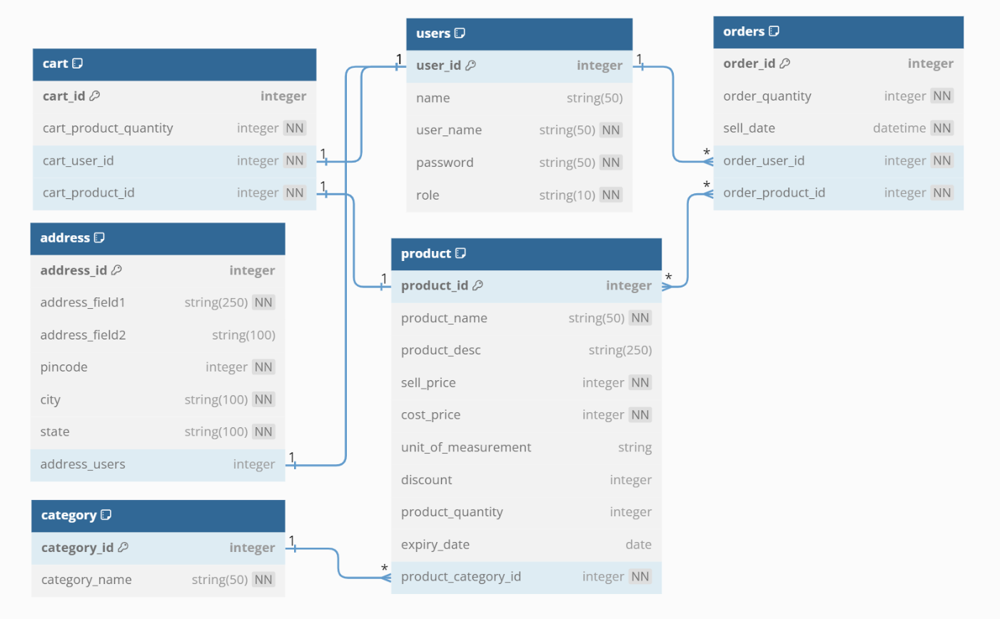

# Grocery Store App

## Description
Using the MVC structure, the first step is to decide the user agents, entities and attributes then design the
database structure using ER diagram, create db and classes, then create blueprints and logic with html
and css for authentication, main controls and api’s. Register blueprints in the app and test the code.

## Technologies Used
Backend has been developed using Python’s Flask framework. Front-end is coded in HTML and CSS for
styling.
The following technologies were used:
1. Flask SQLAlchemy to interact with database and create database classes
2. Flask login to implement authentication
3. Flask Restful to create Rest API’s
4. Flask.Blueprint to modularize the application into three blueprints
5. Other packages and libraries have been used as and when needed for implementing date,
rendering template, fetching request form fields, redirection, etc.

## DB Schema and design
Database has been designed into 6 tables. For diagrams please refer to page 2.
1. Category and Product tables carry inventory information, they have been divided to reduce
redundancy due to multiple-products in one category.
2. Users and addresses store user information.
3. Orders and carts are used to manage order history and maintain user carts

## API Design
Created api for CRUD operations on Category and Products. The API’s allow easy addition of categories
and products into the system. Also, to query the database by providing id for the category or products to
get information about them. One can also get a list of all products and categories by making a GET
request. Find the link to Postman API by clicking here or use the link below. YAML file also added in
submission. You will need to use the downloaded version of postman after setting up the python server to
test these API’s.
https://www.postman.com/flight-explorer-79219161/workspace/my-workspace/collection/28984634-0b36f
844-ee38-4cf3-afb6-27e563a4cb4e?action=share&creator=28984634

## Folder Structure
The application structure is as follows:
Root folder
  1. Project
    a. Templates folder - contains the required html templates.
    b. Static folder - contains the necessary graphs and CSS files.
    c. Instance folder - contains database.sqlite3 file
    d. __init__.py - for initializing the application and registering blueprints
    e. models.py - for database classes
    f. main.py - for controllers for user and admin
    g. auth.py - for authentication login framework
    h. resources.py - for API
  2. Project pdf
     
## Features:
1. Supports new user signup
2. Separate login page for Admin and User
3. Users can browse the products from different categories and add products to cart.
4. Users can also directly buy the product which reduces them from total inventory. Products can
also be bought together by adding to cart and pressing the checkout button.
5. Admin can add and delete categories, products from the inventory.
6. Admin can use API’s to perform CRUD operations on categories and products.

## How to run
[Use Readme.txt inside /project](project/README.txt)

